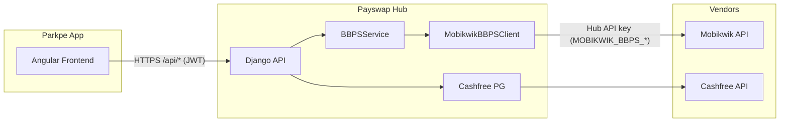
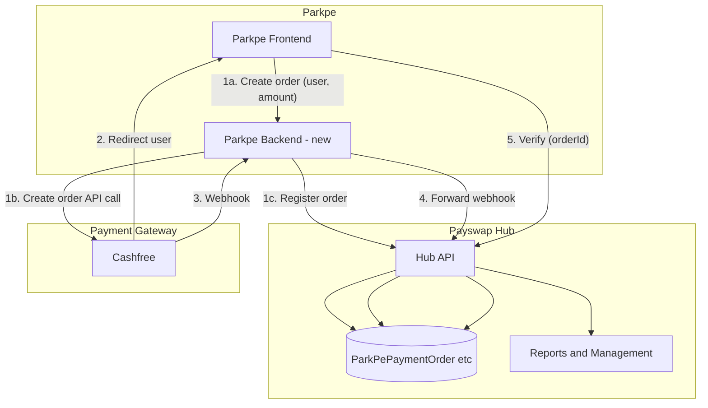

# Parkpe–Hub Unified Plan

---

# Part 1 – JWT Management and Parkpe–Hub Architecture

## 1.1 JWT kaise manage ho raha hai (Parkpe user auth)

**Flow:** Parkpe user login → Hub JWT issue karta hai → Parkpe frontend token store karta hai → har API request par `Authorization: Bearer <token>` bhejta hai.

| Layer                 | Kya hota hai                                                                                                           | File / location                                                                                                                                                                                               |
| --------------------- | ---------------------------------------------------------------------------------------------------------------------- | ------------------------------------------------------------------------------------------------------------------------------------------------------------------------------------------------------------- |
| **Login**             | User email/phone + password Hub ko bhejta hai                                                                          | Parkpe: [real-api.service.ts](frontend-space/projects/parkpe/src/app/core/api/real-api.service.ts) `POST ${apiUrl}/auth/login`                                                                                |
| **Hub auth**          | Django User + Profile se verify; SimpleJWT se `token` + `refreshToken` + `user` return                                 | [api/auth_parkpe/views.py](api/auth_parkpe/views.py) – `AuthLoginView`, `RefreshToken.for_user(user)`                                                                                                         |
| **Token storage**     | Frontend token + refreshToken + user **localStorage** mein save karta hai (reload par login na toote)                  | [auth.service.ts](frontend-space/projects/parkpe/src/app/core/services/auth.service.ts) – `PARKPE_TOKEN_KEY`, `PARKPE_REFRESH_TOKEN_KEY`, `PARKPE_USER_KEY`                                                   |
| **Request pe lagana** | Har `/api/` request (login/register/forgot-password ko chhod kar) pe `Authorization: Bearer <token>` add               | [auth.interceptor.ts](frontend-space/projects/parkpe/src/app/core/interceptors/auth.interceptor.ts) – `headers['Authorization'] = \`Bearer ${token}\``                                                        |
| **Hub pe validate**   | Connect/BBPS/Payment/Voucher views JWTAuthentication use karte hain; middleware bhi JWT allow karta hai (no X-API-Key) | [api_management/middleware.py](api_management/middleware.py) `_get_parkpe_partner_for_jwt`; views: e.g. [vehicle_views.py](api/connect/views/vehicle_views.py) `authentication_classes = [JWTAuthentication]` |

**Summary:** JWT Parkpe frontend par localStorage mein rehta hai; Hub login pe issue karta hai aur baaki APIs pe same token validate karta hai. Parkpe user auth sahi hai to wohi user Hub ke “user service” (profile, etc.) aur Connect/BBPS/Payment/Voucher sab use kar sakta hai – sab Hub se hi serve hota hai.

---

## 1.2 Parkpe vs Hub vs Vendors – relation

**Intended design:**

- Mobikwik (aur baaki vendors) ka relation **sirf Hub** se hai; API keys Hub pe hai.
- Parkpe ka relation bhi **sirf Hub** se hai.
- Parkpe request **sirf Hub** ko jati hai; Hub aage ki request (Mobikwik, Cashfree, etc.) manage karta hai.
- **Parkpe kabhi directly Mobikwik (ya kisi vendor) ko call nahi karta.**

**Current codebase (BBPS, Connect, Verify) is exactly this:**

**Evidence:**

- **Parkpe frontend** – Sirf ek base URL: `environment.apiUrl` (`/api` ya `https://api.parkpe.com`). Saare calls isi ke relative: `/auth/login`, `/bbps/operators`, `/payment/create-order/cashfree`, `/payment/verify/cashfree`, `/connect/vehicles/`, `/voucher/...`. Kahi bhi Mobikwik/Cashfree ka direct URL ya unka API key nahi hai.
- **Hub** – [api/bbps_parkpe/views.py](api/bbps_parkpe/views.py) “Uses Mobikwik backend (BBPSService)”; [portal/services/vendors/mobikwik.py](portal/services/vendors/mobikwik.py) – “Frontend never receives or manages Mobikwik token; it only calls our backend APIs”.
- **Payment (current):** Order create/verify Parkpe se Hub `POST /api/payment/create-order/cashfree` aur `POST /api/payment/verify/cashfree`; actual Cashfree call Hub ke payment views se hota hai.

**Conclusion:** Parkpe direct Mobikwik (ya kisi vendor) ko call nahi karta. Sab request Parkpe → Hub → Hub → vendors. **Exception:** PG IP/Domain whitelist (Part 2) mein create-order aur webhook Parkpe backend se chalenge, lekin management phir bhi Hub.

---

# Part 2 – Payment Gateway IP/Domain Whitelist + Hub Management

## 2.1 Problem

Payment gateways (e.g. Cashfree) often have **IP and Domain whitelist**. Agar PG sirf **Parkpe domain** aur **Parkpe IP** allow karta hai:

- **Request to PG** (create order API, webhook URL) **Parkpe domain / Parkpe IP** se jani chahiye.
- **Management** (transaction records, reports, reconciliation) **Payswap Hub** karega – Parkpe sidha PG se interact karega lekin data aur control Hub pe.

Abhi create order aur webhook dono **Hub** se hit hote hain (Hub IP/domain), isliye PG whitelist = Parkpe only hone par flow change karna padega.

---

## 2.2 Current payment flow (reference)

| Step                       | Kahan se        | Kahan tak                                        | Note |
| -------------------------- | --------------- | ------------------------------------------------ | ---- |
| Create order               | Parkpe frontend | Hub `POST /api/payment/create-order/cashfree`    | [real-api.service.ts](frontend-space/projects/parkpe/src/app/core/api/real-api.service.ts) |
| Hub calls Cashfree         | Hub server      | Cashfree API                                     | [api/parkpe_api/views.py](api/parkpe_api/views.py) `CreateOrderView`; [core/config.py](core/config.py) `get_cashfree_pg_credentials()` |
| Webhook                    | Cashfree        | Hub `POST /api/payment/webhook/cashfree`         | [payment_urls.py](api/parkpe_api/payment_urls.py); `request.build_absolute_uri(...)` = Hub URL |
| Return URL (user redirect) | Cashfree        | Parkpe domain (e.g. parkpe.com/payment/callback) | Already Parkpe domain |
| Verify (after callback)    | Parkpe frontend | Hub `POST /api/payment/verify/cashfree`          | Hub updates order, credits voucher |

---

## 2.3 Target flow (PG whitelist = Parkpe only)

- **Create order:** Parkpe **backend** Cashfree ko call karega (Parkpe IP), phir Hub ko “register this order” bhejega.
- **Webhook:** Cashfree → Parkpe backend (Parkpe IP/domain) → Parkpe backend Hub ko forward karega; Hub same logic chalayega (order update, voucher credit).
- **Return URL:** Parkpe domain (no change).
- **Verify:** Parkpe frontend Hub verify endpoint (no change).
- **Records / Reports:** Sab Hub pe – Parkpe backend koi order/transaction store nahi karega.

---

## 2.4 Implementation plan

### Parkpe Backend (new / existing server)

- **Role:** Sirf PG ke saath direct baat (create order + webhook receive); management nahi.
- **Create order:** Input – user identity (Hub JWT ya short-lived token), amount, currency, return_url (Parkpe domain). Parkpe backend Cashfree API call (Parkpe IP). Response `order_id`, `payment_session_id` frontend ko. **Immediately** Hub ko “Register order” – `order_id`, `user_id`, `amount`, `gateway`, `status=PENDING`. Cashfree credentials: Hub se secure (per-request API ya sync to Parkpe env – policy decision).
- **Webhook endpoint:** Parkpe URL (PG whitelist = Parkpe). Signature verify (Parkpe pe `client_secret`); verify ke baad raw payload Hub ko forward: `POST /api/payment/webhook/relay/cashfree`. Hub existing logic chalayega.

### Hub changes

- **Register order API:** e.g. `POST /api/payment/orders/register`. Auth: Parkpe backend (service token/API key). Body: `order_id`, `user_id`, `amount`, `currency`, `gateway`, optional metadata. Hub: `ParkPePaymentOrder` create, `status=PENDING`.
- **Webhook relay:** `POST /api/payment/webhook/relay/cashfree`. Auth: Parkpe backend. Body: Raw Cashfree payload (and headers for signature). Hub verifies signature, processes as current `CashfreePaymentWebhookView` (success → `_complete_parkpe_payment_order`, fail → FAILED).
- **Credentials:** Option A – Hub “get Cashfree credentials” for Parkpe backend (per-request/short-lived). Option B – Hub syncs to Parkpe backend (env). Prefer Hub as source of truth.
- **Existing create-order:** PG whitelist = Parkpe only hone par Parkpe frontend direct Hub create-order nahi bula sakti; Parkpe flow via Parkpe backend. Hub create-order non-Parkpe/internal use ke liye reh sakta hai.

### Parkpe Frontend

- **Create order:** Parkpe **backend** ko call (same origin / Parkpe API domain); response `orderId`, `paymentSessionId`; Cashfree checkout open (same as today). Return URL Parkpe domain.
- **Verify:** No change – callback se Hub `POST /api/payment/verify/cashfree`.

### Transaction records and reports (management Hub)

- **Storage:** Sab Hub – `ParkPePaymentOrder`, voucher credit, `ParkPeVoucherTransaction` etc. Parkpe backend koi order/transaction store nahi.
- **APIs:** `GET /api/payment/transactions`, `GET /api/payment/transactions/<id>`, `GET /api/payment/orders` – existing Hub APIs (JWT). Portal reports: Hub DB se.

### Security checklist

- Parkpe backend ↔ Hub: strong auth (API key / JWT for service).
- Webhook relay: Hub verifies Cashfree signature (preferred); Parkpe forwards raw body + headers.
- Cashfree credentials: Hub source of truth; Parkpe ko minimal exposure.
- Return URL: Parkpe domain; webhook URL: Parkpe domain/IP for PG whitelist.

---

## 2.5 Summary table (PG flow)

| Item                          | Current (Hub IP)         | Target (PG whitelist = Parkpe)                                    |
| ----------------------------- | ------------------------ | ----------------------------------------------------------------- |
| Create order API call to PG   | Hub server               | **Parkpe backend** (Parkpe IP)                                    |
| Order record created where   | Hub (CreateOrderView)    | **Hub** (via “register order” API from Parkpe backend)            |
| Webhook URL at PG            | Hub URL                  | **Parkpe URL** (Parkpe IP/domain)                                 |
| Webhook processing            | Hub                      | **Parkpe receives → forwards to Hub**; Hub processes (same logic) |
| Return URL (user redirect)    | Parkpe domain            | No change (Parkpe domain)                                         |
| Verify (callback)             | Parkpe → Hub             | No change                                                         |
| Transaction records / reports | Hub                      | **Hub** (no change)                                               |

---

# Unified summary

| Topic | Answer |
| ----- | ------ |
| JWT manage kahan ho raha hai? | Login Hub se; token + refresh + user localStorage; interceptor Bearer lagata hai; Hub validate (views + middleware). |
| Parkpe user auth sahi ho to kya use kar sakta? | Hub user service (profile), Connect, BBPS, Payment, Voucher – sab Hub APIs. |
| Parkpe direct Mobikwik call? | **Nahi.** Parkpe sirf Hub ko call karta hai; Hub vendors (Mobikwik, Cashfree, etc.) ko. |
| PG whitelist = Parkpe only? | Create order + webhook **Parkpe backend** se (Parkpe IP/domain); **management (records, reports)** sab **Hub**; verify + return URL same. |
| Optional docs | [docs/how_system_works.md](docs/how_system_works.md) mein JWT + Parkpe–Hub–vendors + PG whitelist flow short note. |
