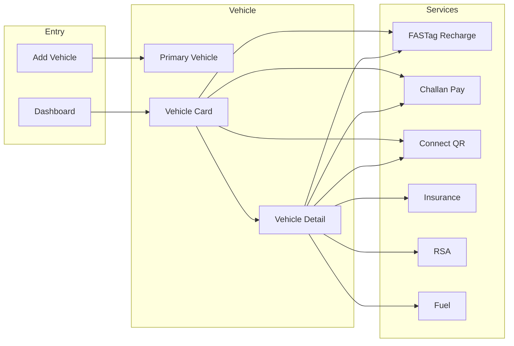

# ParkPe vehicle-centric system audit

## Intended concept (from your brief)

- **Primary concept = Vehicle**: When a customer adds a vehicle, we learn what to sell (type: bike/car/commercial).
- **Primary vehicle**: One vehicle is primary and shows first on the dashboard.
- **Sellable services**: FASTag recharge, Insurance, Connect (QR/contact), Chaalna (challan) payment, RSA, Fuel (future).

Audit checks that everything is arranged around this: correct links, no redundancy, no missing flow, and clear improvements.

---

## Voucher vs Vehicle (important)

- **Voucher = money.** User buys voucher; balance is like a prepaid balance.
- **Admin decides** in which services this voucher can be used (e.g. FASTag, BBPS, Connect recharge) – via service config, not via vehicle.
- **Voucher ka vehicle se koi direct relation nahi hai.** Vehicle is the **context from which user enters** a service (e.g. "Recharge FASTag" from vehicle card) – we prefill reg number for convenience. The payment instrument (voucher) remains generic; we do **not** tie voucher or voucher transactions to a vehicle. No need to add vehicle_id/registration_number to ParkPeVoucherTransaction or to treat voucher as "vehicle-specific money".

---

## Current state (summary)

| Area                     | Current behaviour                                                                                                                                                                                                                                                                                                                  |
| ------------------------ | ---------------------------------------------------------------------------------------------------------------------------------------------------------------------------------------------------------------------------------------------------------------------------------------------------------------------------------- |
| **Vehicle model**        | [portal/models.py](portal/models.py) – `Vehicle`: `vehicle_type` (two_wheeler / four_wheeler / commercial), `is_primary`, RC data. One primary per user (enforced in `save()`). Ordering: `-is_primary`, `-created_at`.                                                                                                            |
| **Dashboard**            | [dashboard.component.ts](frontend-space/projects/parkpe/src/app/features/dashboard/dashboard.component.ts) – Carousel with `displayedVehicle`; primary index on load. **Issue:** Same `summary.fastagBalance` (user-level from BBPS) shown on **every** vehicle card and in Overview – misleading when user has multiple vehicles. |
| **FASTag**               | [fastag-form](frontend-space/projects/parkpe/src/app/features/fastag/fastag-form/fastag-form.component.ts) – Manual "Vehicle Number" input; **not** prefilled from Connect vehicles. No link from vehicle card/detail to FASTag with reg number.                                                                                   |
| **Challan**              | Frontend: search (by vehicle number), list, detail, pay. Real API calls `/challan/search`, `/challan/:id`, `/challan/:id/pay` – **no challan backend in `api/**` (mock or external). Challan search is **not** prefilled from Connect vehicles.                                                                                    |
| **Connect**              | Live (vehicle CRUD, QR, scan, call, chat). **Bug:** In [app-layout](frontend-space/projects/parkpe/src/app/layouts/app-layout/app-layout.component.ts) and [dashboard quick actions](frontend-space/projects/parkpe/src/app/features/dashboard/dashboard.component.ts), Connect is marked `comingSoon: true` – **incorrect**.      |
| **Vehicle detail**       | [connect-vehicle-detail](frontend-space/projects/parkpe/src/app/features/connect/connect-vehicle-detail/) – QR, RC, Edit/Delete. **No CTAs** for "Recharge FASTag for this vehicle", "Pay challans", or "Renew insurance" – vehicle is not used as entry point for services.                                                       |
| **Insurance**            | Shown only in RC (company + upto). No insurance purchase/renew flow. BBPS has generic "insurance" category.                                                                                                                                                                                                                        |
| **RSA / Fuel**           | Not implemented; only mentioned on home as future.                                                                                                                                                                                                                                                                                 |
| **First vehicle**        | When user adds first vehicle, `is_primary` is only set if client sends it; **no backend or frontend rule** to auto-set first vehicle as primary.                                                                                                                                                                                   |
| **vehicle_type**         | Stored and displayed but **not used** to tailor which services or messaging we show (e.g. bike vs car insurance later).                                                                                                                                                                                                            |
| **Voucher transactions** | [ParkPeVoucherTransaction](portal/models.py) has `service_code` (e.g. BBPS). Voucher is service-agnostic money; admin decides where it can be used; **no vehicle link required**.                                                                                                                                                  |

---

## Findings and recommendations

### 1. Correct "Connect" visibility (quick win)

- **Issue:** Connect is live but shown as "Coming soon" in app nav and dashboard quick actions.
- **Change:** In [app-layout.component.ts](frontend-space/projects/parkpe/src/app/layouts/app-layout/app-layout.component.ts) and [dashboard.component.ts](frontend-space/projects/parkpe/src/app/features/dashboard/dashboard.component.ts), remove `comingSoon: true` for the Connect entry (and optionally for FASTag/Challan if you want them clickable before backend is ready).

### 2. Vehicle as entry point for FASTag and Challan

- **Issue:** User must type vehicle number again in FASTag and Challan; vehicle card and vehicle detail do not lead into these flows.
- **Change:**
  - **Dashboard:** On the vehicle card, add small actions e.g. "Recharge FASTag" and "Challans" that navigate to `/fastag` and `/challan/search` with **state** (or query) carrying `registration_number` (and optionally `vehicle_id`) from `displayedVehicle`.
  - **Vehicle detail page:** Add same CTAs (Recharge FASTag, Search challans) with current vehicle’s `registration_number` in state/query.
  - **FASTag form:** On init, if navigation state (or query) has `registration_number`, prefill the vehicle number field.
  - **Challan search:** If state/query has `registration_number`, prefill the vehicle search field.

Result: One place (vehicle) drives the other flows; no redundant typing.

### 3. Dashboard FASTag balance clarity

- **Issue:** `summary.fastagBalance` is a **single** user-level value (from BBPS balance_check) but is shown on each vehicle card and again in Overview – implies per-vehicle balance when it is not.
- **Options:**
  - **A (recommended):** Keep one "FASTag balance" in Overview only. On the vehicle card, **remove** the FASTag line, or replace with a generic line like "Use voucher for FASTag" / "Recharge FASTag" (link to FASTag with this vehicle’s reg number).
  - **B:** If/when backend supports per-vehicle FASTag balance, add `vehicle_id` (or reg no) to balance API and show per-vehicle balance on the card.

Implement **A** so the dashboard is not misleading with current backend.

### 4. First vehicle as primary

- **Issue:** If user adds first vehicle and does not check "Set as primary", no vehicle is primary; list still shows one vehicle first (index 0) but it is not marked primary.
- **Change:** When user has **no** vehicles and adds one, set `is_primary: true` by default. Options:
  - **Frontend:** In add-vehicle form, if `connectVehicles.length === 0`, set `is_primary` to `true` and optionally disable unchecking (or show a note that first vehicle is primary).
  - **Backend:** In [api/connect/views.py](api/connect/views.py) `VehicleListCreateView.post`, after creating the vehicle, if `Vehicle.objects.filter(user=request.user).count() == 1`, set `vehicle.is_primary = True` and save.

Either (or both) is fine; backend ensures consistency even if client omits the flag.

### 5. Challan backend and linking

- **Issue:** Frontend calls `/challan/search`, `/challan/:id`, `/challan/:id/pay` but there is **no** challan API in this repo (only [InstantPay vehicle_challan_lookup](portal/services/vendors/instantpay.py) elsewhere). So either challan is mock or an external service.
- **Change:**
  - If challan is **external**: Keep current UI; only add **vehicle-based entry** (prefill from dashboard/vehicle detail as in point 2).
  - If challan should be **in this backend**: Add ParkPe challan endpoints (e.g. under `api/parkpe_api/` or `api/challan/`) that call the vendor (e.g. InstantPay) and return the shape the frontend expects; then point Angular to these endpoints.

Either way, link "Challans" from vehicle so the flow is vehicle-centric.

### 6. Optional: Use vehicle_type for future upsell

- **Idea:** When you add insurance/RSA/fuel, use `vehicle_type` (and RC data) to show only relevant options (e.g. two_wheeler vs four_wheeler insurance).
- **Change:** No code change now; when building those features, filter or sort offers by `vehicle_type` and optionally by RC (e.g. fuel type, vehicle class).

### 7. Insurance / RSA / Fuel (future)

- **Current:** No flows; only RC insurance display and home-page "coming soon" type messaging.
- **Recommendation:** When you add them, expose them from the **vehicle** (dashboard card + vehicle detail) with prefilled reg/vehicle so the pattern stays "vehicle first, then service". Optionally use `vehicle_type` and RC for eligibility or product list.

---

## Flow diagram (target)

---

## Files to touch (summary)

| Purpose                                  | Files                                                                                                                                                                                                                                                                                                                                                                                                                                                                                                                             |
| ---------------------------------------- | --------------------------------------------------------------------------------------------------------------------------------------------------------------------------------------------------------------------------------------------------------------------------------------------------------------------------------------------------------------------------------------------------------------------------------------------------------------------------------------------------------------------------------- |
| Connect not "Coming soon"                | [app-layout.component.ts](frontend-space/projects/parkpe/src/app/layouts/app-layout/app-layout.component.ts), [dashboard.component.ts](frontend-space/projects/parkpe/src/app/features/dashboard/dashboard.component.ts)                                                                                                                                                                                                                                                                                                          |
| Vehicle → FASTag/Challan links + prefill | [dashboard.component.html](frontend-space/projects/parkpe/src/app/features/dashboard/dashboard.component.html), [connect-vehicle-detail.component.html](frontend-space/projects/parkpe/src/app/features/connect/connect-vehicle-detail/connect-vehicle-detail.component.html), [fastag-form.component.ts](frontend-space/projects/parkpe/src/app/features/fastag/fastag-form/fastag-form.component.ts), challan search component (e.g. [challan-search](frontend-space/projects/parkpe/src/app/features/challan/challan-search/)) |
| FASTag balance on card vs Overview       | [dashboard.component.html](frontend-space/projects/parkpe/src/app/features/dashboard/dashboard.component.html) (and optionally [dashboard.component.scss](frontend-space/projects/parkpe/src/app/features/dashboard/dashboard.component.scss))                                                                                                                                                                                                                                                                                    |
| First vehicle = primary                  | [connect-vehicle-form.component.ts](frontend-space/projects/parkpe/src/app/features/connect/connect-vehicle-form/connect-vehicle-form.component.ts) and/or [api/connect/views.py](api/connect/views.py)                                                                                                                                                                                                                                                                                                                           |

---

## Order of implementation

1. **Quick fixes:** Connect `comingSoon` removal; dashboard FASTag line on card (remove or relabel); first vehicle as primary (frontend or backend).
2. **Vehicle as entry point:** Dashboard and vehicle detail CTAs for FASTag and Challan with reg number in state/query; prefill in FASTag form and challan search.
3. **Backend (if needed):** Challan API in this repo; or confirm external and document. No voucher–vehicle linking (voucher remains admin-configured, service-level only).

After this, the system is audited and aligned with the vehicle-centric idea: primary vehicle and vehicle type drive what we show and sell; services are reachable from the vehicle and prefilled where possible; no redundant or misleading balance on the card; and the way is prepared for insurance/RSA/fuel from the same vehicle entry point.