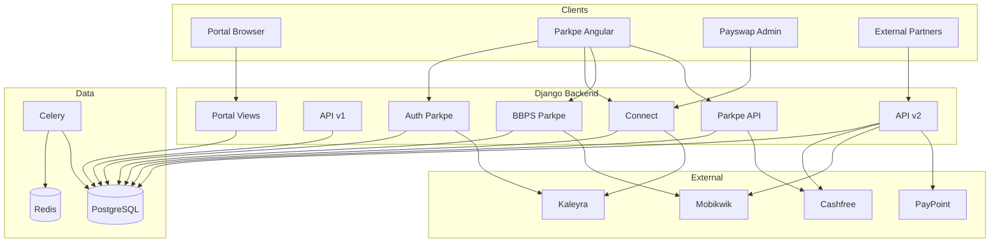

# Payswap – Full Project Audit (Complete Scope)

**Scope:** Pure project mein jo kuch bhi hai sab—Portal (Django templates), API v1/v2, Parkpe (Auth, Connect, BBPS, Dashboard, Voucher, Payment), Payswap frontend (Connect Admin), api_management, aur saari third‑party integrations (Kaleyra, Cashfree, Mobikwik, PayPoint, Euronet, etc.).

---

## 1. Project Understanding Summary (Full Project)

### 1.1 Folder Structure & Modules

| Layer              | Path              | Purpose                                                                                                                                                                                                                                                                                                                                                                                                             |
| ------------------ | ----------------- | ------------------------------------------------------------------------------------------------------------------------------------------------------------------------------------------------------------------------------------------------------------------------------------------------------------------------------------------------------------------------------------------------------------------- |
| **Core**           | `core/`           | Django settings, config (Pydantic), urls, CSRF middleware, test runner                                                                                                                                                                                                                                                                                                                                              |
| **API**            | `api/`            | REST APIs: v1 (internal/JWT), v2 (external/API-key), auth_parkpe, connect, bbps_parkpe, parkpe_api (dashboard, payment, voucher)                                                                                                                                                                                                                                                                                    |
| **Portal**         | `portal/`         | Full Django web app: auth (signin/signup/MFA/PIN), dashboards (admin/super/employee/distributor/retailer/customer/vendor), profile, users, KYC, wallet, logs, tickets, services (BBPS test, vendors, Kaleyra), vouchers (brands, clients, batches, issue, reports), VoucherX, reseller/partners, parkpe (app-management, connect dashboard), api-registry. Views in `portal/views.py` and `portal/views/legacy.py`. |
| **API Management** | `api_management/` | API key auth, registry, rate limits, exception handler, API logging middleware                                                                                                                                                                                                                                                                                                                                      |
| **Frontend**       | `frontend-space/` | Angular workspace: **parkpe** (consumer app – auth, connect, dashboard, voucher, payment, FASTag, challan), **payswap** (admin app – Connect Admin: overview, calls, chats analytics)                                                                                                                                                                                                                               |

### 1.2 What the Full System Does

- **Portal:** Internal/staff web UI—login (session + MFA), role-based dashboards, user/KYC/wallet management, logs, tickets, service/vendor config, gift vouchers (brands, batches, issue, reports), VoucherX, reseller API keys, Parkpe app config (service + payment gateway), Connect dashboard (logs), API product/registry toggles.
- **API v1:** JWT token obtain/refresh, runtime-config for Angular, health check (internal).
- **API v2:** External partner APIs (API-key + optional IP whitelist): vouchers (issue, redeem, balance, PIN change, batches), KYC (PAN, Aadhaar, bank, DL, voter, passport, GST, face), payments (initiate, status, refund, list), SMS/OTP, BBPS (Mobikwik), AEPS (PayPoint), DMT (PayPoint), vendors/services flow. Throttling per key/service/partner.
- **Parkpe consumer:** Angular app—register/login (email/password or phone OTP), profile, dashboard (vehicles, voucher summary, FASTag, challan, Connect), Connect (vehicles, QR, scan, call, chat), voucher balance/purchase, payment flows, BBPS (bill fetch/pay). Backend: `api/auth_parkpe`, `api/connect`, `api/bbps_parkpe`, `api/parkpe_api`, `api/dashboard/`, `api/payment/`, `api/voucher/`.
- **Payswap admin app:** Connect Admin only (overview, call analytics, chat analytics)—calls Parkpe Connect admin API (`api/connect/admin/`).

### 1.3 Core Business Logic (Across Products)

- **Identity & access:** Portal = session + MFA + PIN lock; Parkpe = JWT (SimpleJWT); API v2 = API key + permissions (JSON) + rate_limit + IP whitelist.
- **Vouchers:** Portal/VoucherX for issuance; Parkpe uses voucher balance (ParkPeVoucherTransaction, service_code) for payments (e.g. RC view, BBPS); API v2 exposes issue/redeem/balance to partners.
- **Connect:** Vehicle → QR → scan (public) → call (Kaleyra) / chat (thread + polling); logs to ConnectScanLog, ConnectCallLog, LogEntry.
- **BBPS:** Mobikwik (and optionally Euronet); operators, fetch bill, pay bill; Parkpe BBPS for consumer; API v2 for partners.
- **Payments:** Cashfree PG; Parkpe payment orders; API v2 initiate/status/refund.
- **KYC/Verification:** Cashfree (and possibly others); portal KYC submit; API v2 KYC endpoints for partners.

### 1.4 Data Flow (High-Level Full Project)

### 1.5 Where Responsibilities Are Poorly Separated (Full Project)

- **Portal:** `views.py` + `views/legacy.py` very large; mix of auth, dashboard, profile, services, vouchers, reseller, parkpe; no clear bounded contexts (e.g. voucher vs reseller vs parkpe).
- **API:** Connect business logic inside `api/connect/views.py`; auth_parkpe and connect duplicate `_user_to_angular`, `_phone_lookup_candidates`; Parkpe-specific and generic API keys both in api_management.
- **Models:** All in `portal/models.py` (User, Profile, Wallet, KYC, Vehicle, Connect*, Voucher*, Ticket, LogEntry, ResellerPartner, etc.)—single large namespace.
- **Logging:** Multiple patterns—Connect `_vehicle_log`, portal `log_user_action_task`, api_management APILoggingMiddleware, OTP service logger with PII risk.

---

## 2. Critical Issues (High Risk) – Full Project

| #   | Issue                                                  | Location                                                                                                               | Risk                                                |
| --- | ------------------------------------------------------ | ---------------------------------------------------------------------------------------------------------------------- | --------------------------------------------------- |
| 1   | **OTP and phone in logs (plaintext)**                  | `portal/services/otp_service.py`: `extra_data` with `phone_full`, `otp_code`, `normalized_phone`                       | **Critical** – Log exposure of PII/OTP              |
| 2   | **Call initiate unauthenticated + no rate limit**      | `api/connect/views.py` – `ConnectCallInitiateView` AllowAny, no throttle; body accepts any `scanner_phone`             | **Critical** – Call bombing, cost abuse, harassment |
| 3   | **Scan endpoint (by-qr) no rate limit**                | `VehicleByQRView` – AllowAny, no throttle                                                                              | **High** – Scan flooding, QR enumeration, DB load   |
| 4   | **Auth Parkpe OTP/register only DRF default throttle** | `api/auth_parkpe/views.py` – No explicit throttle on OTP request/verify, register send-otp/verify                      | **High** – OTP brute-force, SMS bombing             |
| 5   | **Portal login rate limit only in-memory/cache**       | `portal/views.py` / `legacy.py` – `login_attempts:{client_ip}` cache; no per-user lockout, no audit of lockout         | **High** – Credential stuffing if cache evicts      |
| 6   | **API v2 API key storage and validation**              | `api_management` – Ensure key hashing, no key in logs; IP whitelist enforced on all v2 endpoints                       | **High** – Key leak or bypass                       |
| 7   | **Voucher redeem/PIN/OTP**                             | API v2 and portal – Ensure rate limit and audit on redeem; PIN/OTP not logged                                          | **High** – Theft, enumeration                       |
| 8   | **Portal session and MFA**                             | 5-min inactivity, MFA for sensitive roles – Ensure MFA enforced on all sensitive paths (wallet, permissions, api-keys) | **Medium–High**                                     |

---

## 3. Medium Issues – Full Project

- **Chat polling:** Connect chat uses 2.5s polling; no WebSocket; does not scale for 50K+ chats.
- **No per-IP/per-qr rate limit on call/initiate** (and no verification of scanner_phone).
- **Connect:** No message body length limit on chat send.
- **Duplicate code:** `_user_to_angular`, `_phone_lookup_candidates` in auth_parkpe and connect; repeated vehicle filter patterns.
- **Inconsistent API response shape:** Auth vs connect vs API v2 vs Parkpe dashboard—different envelopes; only errors standardized (api_management).
- **Portal legacy:** Large `portal/views/legacy.py`; many views; dead code and duplication possible.
- **Single Procfile:** Only `web: gunicorn`; Celery worker/beat not in same Procfile (deploy/sizing risk).
- **No CI/CD in repo:** No GitHub Actions/Jenkinsfile; quality and deploy not codified.
- **API v2 idempotency:** Check financial endpoints (payment, voucher redeem, BBPS pay) for idempotency keys and duplicate handling.
- **Portal export:** Log export, voucher reports—ensure large exports are async (Celery) or paginated to avoid timeouts.

---

## 4. Minor Improvements – Full Project

- **Naming:** Unify API naming (parkpe vs connect vs auth_parkpe); consider single `/api/parkpe/` prefix with sub-routes.
- **Config:** Move OTP/scanner/chat limits (3/10min, 2.5s poll, 50 msgs) to config/settings.
- **Indexes:** Review portal and connect queries; add composite indexes where needed (e.g. user + created_at, thread + created_at).
- **Frontend:** Parkpe and Payswap both use `environment.apiUrl`; ensure prod builds use production env; no dev URLs in prod.
- **Admin/staff-only:** Connect admin stats, Parkpe app-management, api-registry, reseller—ensure all require staff/super and optional rate limit on heavy aggregations.
- **Documentation:** API docs (portal api-docs, drf-spectacular) and README—keep in sync with actual endpoints and env vars.

---

## 5. Unnecessary Components – Full Project

- Duplicate `_phone_lookup_candidates` and `_user_to_angular` (consolidate in one module).
- OTP service over-logging with PII (remove once PII is stripped).
- Possible dead views in `portal/views/legacy.py` (needs dependency/usage scan).
- Redundant or duplicate voucher flows (VoucherX vs legacy voucher issue) if both used for same use case—clarify and deduplicate.

---

## 6. Missing Features – Full Project

- **Realtime:** Connect chat → WebSocket/SSE; no realtime elsewhere required immediately.
- **Rate limiting:** Explicit on Connect (by-qr, call/initiate, scanner OTP), Auth Parkpe OTP/register, and critical Portal endpoints (login, forgot-password, OTP).
- **Caller verification:** Verify scanner_phone (e.g. OTP or JWT) before call/initiate.
- **Message length and spam:** Connect chat body max length; optional per-thread/user throttle.
- **CI/CD:** Build, test, deploy for backend + both frontends.
- **Observability:** Prometheus/Grafana (or equivalent); structured logging with trace IDs; Sentry for all apps.
- **Backup/restore and runbooks:** DB, Redis; failover for Celery.
- **Enterprise:** SSO, audit export, Connect report resolution workflow, optional multi-tenancy.
- **Portal:** Async or paginated export for large reports; queue for heavy voucher batch operations if not already.

---

## 7. Scalability Risk Score: **6/10** (Full Project)

- Single Django app; Celery + Redis; DB pooling and indexes help. Connect call synchronous to Kaleyra; chat polling does not scale; no horizontal scaling design documented; public Connect endpoints unrate-limited. API v2 has throttling; Portal and Parkpe APIs rely on DRF defaults for many routes. To reach 10M+ users: rate limits, call queue, realtime chat, CDN, read replicas, worker scaling.

---

## 8. Security Risk Score: **7/10** (Full Project)

- OTP/phone in logs (critical); call/initiate unauthenticated and unrate-limited (critical); scan unrate-limited (high); auth OTP/register weak throttle (high); Portal login rate limit cache-based. IDOR guarded on Connect thread/vehicle; API v2 uses API key + permissions. Voucher and payment flows need idempotency and audit. Improve: remove PII from logs; add endpoint-specific rate limits; verify scanner_phone for call; strengthen auth and portal login limits.

---

## 9. Architecture Maturity Score: **5/10** (Full Project)

- Monolith with mixed concerns; Portal very large; no clear service layer for Connect or voucher; duplication across auth_parkpe and connect; API v2 well-structured with throttling and registry. Improve: service layer for Connect and voucher; shared auth/serialization; consistent logging and error format across Parkpe and Portal.

---

## 10. Immediate 30-Day Fix Plan (Full Project)

1. **Security (Week 1)**
  - Remove OTP and full phone from all logs (`portal/services/otp_service.py`); mask everywhere.  
  - Rate limits: Connect call/initiate (per-IP + per-qr/scanner), VehicleByQR (per-IP), Auth Parkpe OTP/register (stricter anon + per-phone).  
  - Optional: Require JWT or recent scanner OTP for call/initiate.
2. **Connect + Auth (Week 2)**
  - Connect: message body max length; throttle on by-qr, call/initiate, scanner OTP.  
  - Unify `_user_to_angular` and `_phone_lookup_candidates`; use from auth_parkpe and connect.
3. **Portal + API (Week 3)**
  - Review Portal login rate limit (persistence, per-user lockout, audit).  
  - Ensure API v2 key never in logs; IP whitelist enforced.  
  - Voucher redeem/PIN/OTP: rate limit and no PIN/OTP in logs.
4. **Ops (Week 4)**
  - Procfile or docs: Celery worker + beat.  
  - Minimal CI (lint, test, frontend build).  
  - Health endpoint for DB, Redis, optional Celery.

---

## 11. Long-Term Enterprise Roadmap (Full Project)

- **Realtime:** Connect chat → WebSocket/SSE; Redis pub/sub for multi-instance.
- **Resilience:** Queue call initiation (Celery → Kaleyra); circuit breakers for Kaleyra, Cashfree, Mobikwik.
- **Observability:** Prometheus + Grafana; structured JSON logging; Sentry; trace IDs across Portal, API, Parkpe.
- **Scale:** Rate limiting and caching; DB read replicas; CDN for Angular; horizontal scaling for web and workers.
- **Architecture:** Service layer for Connect and voucher; bounded contexts (portal vs api vs parkpe); standard API envelope for all Parkpe/partner APIs.
- **Enterprise:** SSO; audit export; Connect report workflow; optional multi-tenancy; compliance (RBI, DLT) documented and enforced.

---

## Scope Checklist (Audit Covers)

- **Core:** settings, config, urls, middleware  
- **API v1:** JWT, health, runtime-config  
- **API v2:** Vouchers, KYC, payments, SMS, BBPS, AEPS, DMT, vendors, throttling, API key  
- **API auth_parkpe:** Login, OTP, register, profile, logout, forgot-password  
- **API connect:** Vehicles, QR, scan, call, chat, report, admin stats  
- **API bbps_parkpe:** Parkpe BBPS (Mobikwik)  
- **API parkpe_api:** Dashboard, payment, voucher URLs  
- **Portal:** Auth, dashboards, profile, users, KYC, wallet, logs, tickets, services, vouchers, VoucherX, reseller, parkpe, api-registry  
- **api_management:** Exception handler, API logging, API key middleware  
- **Frontend parkpe:** Auth, connect, dashboard, voucher, payment, FASTag, challan  
- **Frontend payswap:** Connect Admin  
- **Integrations:** Kaleyra (SMS, Voice), Cashfree (Verification, PG), Mobikwik BBPS, PayPoint AEPS/DMT, Euronet (optional), Instantpay

**Ye audit pure Payswap project par hai—Parkpe Connect ke alawa Portal, API v1/v2, Parkpe APIs, Payswap admin app, aur saari integrations sab include hain.**