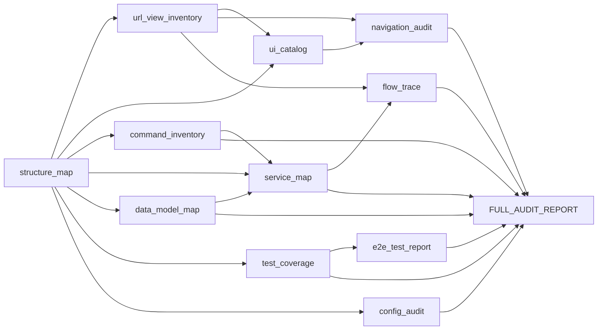

# Audit Self-Assessment

**Purpose:** Self-assessment of the Phases 1–12 audit: what we built, why, how it connects, what is redundant or essential, and (from findings) what in the project exists and works vs what is vestigial or useless. No code or audit edits—this document only.

---

## 2.1 What we built and why (Phase-by-phase)

For each deliverable: **What** it is, **Why** it was built, **Kis kaam aata hai** (how it is used).

| # | Deliverable | What | Why | Kis kaam aata hai |
|---|-------------|------|-----|-------------------|
| 1 | **structure_map.md** | Lists Django apps, API modules, portal modules, Angular projects, scripts, docs, entry points, URL tree, template layout. | So we know where everything lives in the repo. | Isse URL/view aur UI catalogs ko pata chalta hai kaunse apps/templates scan karne hain; cleanup ke liye boundary clear hoti hai. |
| 2 | **url_view_inventory.md** | URL → view → file → purpose; grouped by Auth, Dashboard, Partner, Billing, Governance, Super Admin, etc. | To list every route and view and find duplicates/deprecated. | Duplicate routes, same feature in 2 places, admin vs Super Admin overlap identify karne ke liye; removal/consolidation plan. |
| 3 | **ui_catalog.md** | Screen \| Route \| View/Controller \| API \| Purpose for Portal and Angular. | To list every screen and its data source. | Duplicate dashboards, duplicate partner/billing/settings pages, missing UI for a capability dekhne ke liye. |
| 4 | **command_inventory.md** | Name \| Purpose \| Related service \| UI exists? \| Risk for all management commands and scripts. | To list every CLI command and whether it has a UI. | Commands doing UI work, no-UI commands, duplicate/deprecated commands; “sab kuch UI se manageable” gap. |
| 5 | **service_map.md** | Services by directory; core flows (billing, auth, governance, settlement, SLA, fraud); dependencies; duplicated logic. | To map business logic and who calls whom. | Same logic in multiple places, multiple email senders, multiple audit writers; ownership aur consolidation. |
| 6 | **data_model_map.md** | Models by app/domain (Auth, Partner, Billing, Governance, System, etc.); table names; redundancy/deprecation notes. | To map data ownership and duplicate/similar tables. | Duplicate tables, similar-purpose tables, multiple logs; schema cleanup aur single source of truth. |
| 7 | **navigation_audit.md** | Portal sidebar, governance nav, Super Admin nav, Angular nav; every link and target. | To find dead links, duplicate tabs, orphan pages, inconsistent names. | Nav confusion fix, dead link remove, “Control Tower” / “Partners” jaisa naming clarify. |
| 8 | **test_coverage.md** | Test files and targets; coverage by area; gaps; duplicate tests. | To see what is tested and what is missing. | Untested features, weak areas, duplicate tests; test plan aur risk. |
| 9 | **config_audit.md** | Settings overview, env vars vs usage, FeatureFlag list and usage; unused/duplicate/dead. | To find unused env, duplicate flags, dead config. | Unused flags/config hataane, .env.example complete, single kill-switch doc. |
| 10 | **flow_trace.md** | Entry → service → DB → vendor → output for Connect, BBPS, Billing, Partner onboarding, Governance, Job runner, etc. | To trace major flows end-to-end. | Flow samajhne, silent failure points, vendor/DB touch points; runbooks aur monitoring. |
| 11 | **e2e_test_report.md** | Pytest results: passed, failed, skipped (and flaky if run). | To see if the system is working or silently failing. | Current test health, fail list for fix, “system works” ya “silently failing” answer. |
| 12 | **FULL_AUDIT_REPORT.md** | Summaries of steps 1–11; findings (Duplications, Dead zones, Ownership gaps, Risk areas, UI gaps, Command overload, Tech debt); final answers table. | Single entry for all findings and answers. | Duplicate/useless/missing/risky/solid ek jagah; cleanup approval se pehle fact base. |

---

## 2.2 How deliverables connect (dependency map)

Step 1 (structure) is the base. Step 2 (URLs) and Step 3 (UI) use it. Step 7 (navigation) uses URLs + UI. Step 5 (service) uses structure + commands + models. Step 10 (flow) uses services + URLs. Step 8 (test coverage) and Step 11 (e2e) link tests to features. The final report aggregates 1–11. There is no circular dependency.

---

## 2.3 What in the audit is redundant or “bewajah”

**Overlap between our own docs**

- **url_view_inventory** and **ui_catalog** both list “which view serves which route”. One is URL→view, the other screen→route→view→API. Different lens (routes vs screens). Keep both.
- **flow_trace** vs **service_map**: flow_trace is “entry→exit” per flow; service_map is “which services exist and which flow uses them”. Complementary, not duplicate.
- **Conclusion:** No audit deliverable is fully redundant; each answers a different question. FULL_AUDIT_REPORT could be “summary only” and point to others, but it is still needed as the single entry for “findings + final answers”.

**Truly optional for “minimal audit”**

- **e2e_test_report** is evidence of current test state. If someone only wants structure/URLs/UI/commands, they could skip running tests—but for “is the system working or silently failing” it is needed. So keep.

---

## 2.4 What is essential for the stated goal

**Goal (from prompt):** Make everything manageable from UI; know what is duplicate, unused, overlapping, missing in Admin UI, only-via-command, confusing in nav; know if system works or silently fails.

**Essential deliverables**

- structure_map (where things are)
- url_view_inventory (duplicate/deprecated routes)
- ui_catalog (duplicate screens, missing UI)
- command_inventory (what has UI vs CLI-only)
- service_map (duplicate logic, who does what)
- data_model_map (duplicate/similar tables)
- navigation_audit (dead/confusing links)
- FULL_AUDIT_REPORT (findings + final answers)

**Supporting but not strictly minimal**

- test_coverage (gaps), config_audit (unused flags/config), flow_trace (how flows work), e2e_test_report (current pass/fail). They support “risky/solid”, “silently failing”, and cleanup decisions.

---

## 2.5 What in the codebase exists and works correctly (from audit findings)

- API tests (governance, partner, smoke, v2) pass.
- Super Admin system control (access, job run, health center) tests pass.
- Auth, wallet, execution engine, logging tests mostly pass.
- Production smoke and partner governance green.
- All audited nav links resolve (no dead links).
- Nine commands runnable from System Control; job run creates SystemJobRun and audit.
- Feature flag `api_access` and kill switch (Redis) are used in middleware.
- Core flows (Connect, BBPS, Billing, Partner onboarding, Governance, Super Admin job run) are implemented and traced.

---

## 2.6 What in the codebase exists but has no real use or is vestigial

**Exists, little or no use**

- Feature flag codes in DB other than `api_access` (never checked in code).
- `/api/v1/control/*` (deprecated in favour of `/api/control/` but still present).
- Second Super Admin mount (`/super-admin/` in addition to `/dashboard/super-admin/`).
- ResellerDashboardView at both `/partners/` and `/reseller/` (same view, two URLs).
- send_parkpe_test_email as both management command and script (duplicate capability).

**Vestigial / “ban gayi par kaam nahi”**

- Unused feature flag rows (unless code is added to check them).
- v1 control routes: audit said “deprecated but active”—so still used; if later proven unused, they become vestigial.
- Template `portal/profile/complete.html` missing but referenced by a view (test fails)—view/code exists, template does not (inverted: code expects something that does not exist).

**Not vestigial but duplicate**

- Two run-command entry points (System vs System Control); both work, one does not create SystemJobRun.
- Two API log tables (CashfreeAPILog vs APILog); both used, different scope.
- Multiple email send paths (all used).

---

## 2.7 What is needed but missing or weak (from audit)

**Missing in UI**

- Most commands (only 9 in System Control).
- Unified billing/settlement screen.
- Env vars API_GOVERNANCE_* and API_LOG_SAMPLE_RATE not in .env.example.

**Missing tests**

- Billing, Connect, BBPS (unit); api_management services (direct tests).

**Weak or confusing**

- Naming (“Control Tower” = two different pages); “Partners” vs “Partner Management”.
- Two kill mechanisms (Redis vs env) without single doc of precedence.

---

**End of Self-Assessment. No code or audit file changes.**
