# Consolidation Phase C — Unified Control Center Design

**Architecture only. No UI coding.**

This document defines one logical admin platform with a single hierarchy. Existing screens, routes, views, services, and permissions are mapped into that hierarchy. A single sidebar and consistent naming are proposed.

**Inputs:** Audit reports ([FULL_AUDIT_REPORT.md](../audit/FULL_AUDIT_REPORT.md), [structure_map](../audit/structure_map.md), [url_view_inventory](../audit/url_view_inventory.md), [ui_catalog](../audit/ui_catalog.md), [service_map](../audit/service_map.md), [data_model_map](../audit/data_model_map.md), [navigation_audit](../audit/navigation_audit.md), [command_inventory](../audit/command_inventory.md), [flow_trace](../audit/flow_trace.md), [e2e_test_report](../audit/e2e_test_report.md)). Current code: `portal/views/super_admin/`, `portal/views/governance/`, `core/urls.py`, `portal/urls.py`.

---

## Hierarchy overview

```mermaid
flowchart TB
  subgraph root [Unified Control Center]
    SA[SUPER ADMIN]
    GOV[GOVERNANCE]
    OPS[OPERATIONS]
    PM[PARTNER MANAGEMENT]
    AN[ANALYTICS]
  end
  SA --> SA_Health[System Health]
  SA --> SA_Jobs[Jobs and Cron]
  SA --> SA_Kill[Kill Switch]
  SA --> SA_Flags[Feature Flags]
  SA --> SA_SLA[SLA and Uptime]
  SA --> SA_Fraud[Fraud]
  SA --> SA_Logs[Logs]
  SA --> SA_Alerts[Alerts]
  SA --> SA_Retention[Retention]
  SA --> SA_Config[Config]
  GOV --> GOV_Registry[API Registry]
  GOV --> GOV_Subs[Subscriptions]
  GOV --> GOV_Vendor[Vendor Control]
  OPS --> OPS_Billing[Billing]
  OPS --> OPS_Settlement[Settlement]
  OPS --> OPS_Recon[Reconciliation]
  OPS --> OPS_Growth[Growth]
  PM --> PM_Partners[Partners]
  PM --> PM_Keys[API Keys]
  PM --> PM_Wallets[Wallets]
  PM --> PM_Limits[Limits]
  AN --> AN_Traffic[Traffic]
  AN --> AN_Revenue[Revenue]
  AN --> AN_SLA[SLA]
  AN --> AN_Risk[Risk]
```

---

## SUPER ADMIN

### System Health

| Item | Current implementation |
|------|-------------------------|
| **Screens** | Health Center (SuperAdminHealthCenterView), Control Tower health widget (ControlTowerView), System Status (SystemStatusView) |
| **Routes** | `/dashboard/super-admin/health-center/`, `/dashboard/governance/control-tower/`, `/dashboard/system-status/` (also `/dashboard/governance/system-status/`) |
| **Backend views** | SuperAdminHealthCenterView, ControlTowerView, SystemStatusView |
| **Services** | control_tower_health (get_health_summary, get_celery_summary), api.internal.views.get_health_payload |
| **Permissions** | Super Admin / staff |
| **Data sources** | SystemJobStatus, Redis, DB health, Celery |

### Jobs and Cron

| Item | Current implementation |
|------|-------------------------|
| **Screens** | System Control (run job list, run button), Job History (run list, log download) |
| **Routes** | `/dashboard/super-admin/system-control/`, `/dashboard/super-admin/system-control/run/`, `/dashboard/super-admin/job-history/`, `.../job-history/<run_id>/download/` |
| **Backend views** | SuperAdminSystemControlView, SuperAdminRunJobView, SuperAdminJobHistoryView, SuperAdminJobRunLogDownloadView |
| **Services** | job_run_service, command_runner_service, system_job_service, control_audit_service |
| **Permissions** | Super Admin only |
| **Data sources** | SystemJobStatus, SystemJobRun |

### Kill Switch

| Item | Current implementation |
|------|-------------------------|
| **Screens** | Governance Emergency, Super Admin Emergency (duplicate UIs; one canonical recommended) |
| **Routes** | `/dashboard/governance/emergency/`, `/dashboard/governance/emergency/kill-switch/`; `/dashboard/super-admin/emergency/`, `.../emergency/kill-switch/` |
| **Backend views** | GovernanceEmergencyView, GovernanceKillSwitchPostView; SuperAdminEmergencyView, SuperAdminKillSwitchPostView |
| **Services** | Cache (GOV_KILL_SWITCH_CACHE_KEY), control_audit_service |
| **Permissions** | Super Admin / governance role |
| **Data sources** | Redis cache, ControlAuditLog |

### Feature Flags

| Item | Current implementation |
|------|-------------------------|
| **Screens** | Governance Settings (feature flags list/edit) |
| **Routes** | `/dashboard/governance/settings/` |
| **Backend views** | GovernanceSettingsView |
| **Services** | api_management.feature_flags (is_feature_enabled), API control feature-flags |
| **Permissions** | Governance / staff |
| **Data sources** | FeatureFlag, FeatureFlagOverride |

### SLA and Uptime

| Item | Current implementation |
|------|-------------------------|
| **Screens** | System Status (SystemStatusView), Control Tower (job SLA status), compute_sla output in Job History |
| **Routes** | `/dashboard/system-status/`, `/dashboard/governance/control-tower/` |
| **Backend views** | SystemStatusView, ControlTowerView |
| **Services** | system_job_service, control_tower_health |
| **Permissions** | Super Admin / staff |
| **Data sources** | SystemJobStatus, APISLAStat, APILog |

### Fraud

| Item | Current implementation |
|------|-------------------------|
| **Screens** | Super Admin section (no dedicated fraud screen); fraud_scan run from System Control |
| **Routes** | Run via System Control; optional future `/dashboard/super-admin/fraud/` for report |
| **Backend views** | — (command only today) |
| **Services** | fraud_scan command |
| **Permissions** | Super Admin |
| **Data sources** | Command output / logs |

### Logs

| Item | Current implementation |
|------|-------------------------|
| **Screens** | Portal Logs (LogListView, LogDetailView), API registry logs (APILogListView) |
| **Routes** | `/logs/`, `/logs/<pk>/`, `/dashboard/admin/api-registry/logs/` |
| **Backend views** | LogListView, LogDetailView, APILogListView |
| **Services** | — |
| **Permissions** | Staff (logs); Admin (API registry logs) |
| **Data sources** | LogEntry, APILog |

### Alerts

| Item | Current implementation |
|------|-------------------------|
| **Screens** | Super Admin Alerts (SuperAdminAlertsView) |
| **Routes** | `/dashboard/super-admin/alerts/` |
| **Backend views** | SuperAdminAlertsView |
| **Services** | — |
| **Permissions** | Super Admin |
| **Data sources** | SystemAlertRule |

### Retention

| Item | Current implementation |
|------|-------------------------|
| **Screens** | archive_apilog run from System Control; no dedicated retention policy UI |
| **Routes** | Via System Control run job |
| **Backend views** | — |
| **Services** | archive_apilog command |
| **Permissions** | Super Admin |
| **Data sources** | APILog, CSV export |

### Config

| Item | Current implementation |
|------|-------------------------|
| **Screens** | Super Admin System (SuperAdminSystemView), API & Access (SuperAdminAPIAccessView), Security (SuperAdminSecurityView) |
| **Routes** | `/dashboard/super-admin/system/`, `.../api-access/`, `.../security/` |
| **Backend views** | SuperAdminSystemView, SuperAdminAPIAccessView, SuperAdminSecurityView |
| **Services** | — |
| **Permissions** | Super Admin |
| **Data sources** | Config / env (read-only in UI) |

---

## GOVERNANCE

### API Registry

| Item | Current implementation |
|------|-------------------------|
| **Screens** | Dashboard admin API registry (product list, endpoint list, toggle, logs), Governance APIs (GovernanceAPIsView, toggle) |
| **Routes** | `/dashboard/admin/api-registry/` (product, endpoints, logs), `/dashboard/governance/apis/`, `.../apis/<pk>/toggle/` |
| **Backend views** | APIProductListView, APIRegistryListView, APIRegistryToggleView, APILogListView; GovernanceAPIsView, GovernanceAPIToggleView |
| **Services** | — |
| **Permissions** | Admin / staff |
| **Data sources** | APIProduct, APIRegistry, APILog |

### Subscriptions

| Item | Current implementation |
|------|-------------------------|
| **Screens** | Governance Partners (GovernancePartnersView) — partner API subscriptions |
| **Routes** | `/dashboard/governance/partners/` |
| **Backend views** | GovernancePartnersView |
| **Services** | — |
| **Permissions** | Governance / staff |
| **Data sources** | PartnerAPISubscription, ResellerPartner, APIRegistry |

### Vendor Control

| Item | Current implementation |
|------|-------------------------|
| **Screens** | Admin partner vendor assignment, Service catalog |
| **Routes** | `/admin/partners/<id>/vendors/`, `/admin/partners/vendors/dashboard/`, `/admin/partners/services/catalog/` |
| **Backend views** | AdminPartnerVendorAssignmentView, VendorManagementDashboardView, ServiceCatalogView |
| **Services** | partner_vendor_service |
| **Permissions** | Admin |
| **Data sources** | PartnerVendorAssignment, ApiVendor, Service |

---

## OPERATIONS

### Billing

| Item | Current implementation |
|------|-------------------------|
| **Screens** | run_billing_cycle / generate_invoices via System Control; Admin partner pricing view |
| **Routes** | System Control run job; `/admin/partners/<id>/pricing/` |
| **Backend views** | AdminResellerPartnerPricingView; run via SuperAdminRunJobView |
| **Services** | billing_service |
| **Permissions** | Super Admin (run); Admin (pricing view) |
| **Data sources** | ResellerPartnerPricing, ResellerPartnerTransaction, ResellerPartnerSettlement |

### Settlement

| Item | Current implementation |
|------|-------------------------|
| **Screens** | Admin partner settlement list, process settlement; Enterprise settlement API (read-only) |
| **Routes** | `/admin/partners/<id>/settlement/`, `.../settlement/<id>/process/`; `/api/enterprise/settlement/` |
| **Backend views** | AdminResellerPartnerSettlementView, AdminResellerPartnerSettlementProcessView |
| **Services** | billing_service, partner_accounting_service |
| **Permissions** | Admin; Enterprise API (token) |
| **Data sources** | ResellerPartnerSettlement |

### Reconciliation

| Item | Current implementation |
|------|-------------------------|
| **Screens** | reconcile_daily via System Control; Enterprise reconciliation API |
| **Routes** | System Control; `/api/enterprise/reconciliation/` |
| **Backend views** | — (command + API) |
| **Services** | reconcile_daily command, wallet_service |
| **Permissions** | Super Admin; Enterprise API |
| **Data sources** | Wallet, WalletTransaction, ledger |

### Growth

| Item | Current implementation |
|------|-------------------------|
| **Screens** | Super Admin Growth (SuperAdminGrowthView) |
| **Routes** | `/dashboard/super-admin/growth/` |
| **Backend views** | SuperAdminGrowthView |
| **Services** | growth_metrics |
| **Permissions** | Super Admin |
| **Data sources** | ResellerPartner, ResellerPartnerTransaction, ResellerPartnerSettlement |

---

## PARTNER MANAGEMENT

### Partners

| Item | Current implementation |
|------|-------------------------|
| **Screens** | Admin partners (list, onboard, detail, pricing, settlement, vendors), Super Admin partners (read-only list/detail) |
| **Routes** | `/admin/partners/`, `.../list/`, `.../onboard/`, `.../<id>/`, `.../pricing/`, `.../settlement/`, `.../vendors/`; `/dashboard/super-admin/partners/`, `.../partners/<pk>/` |
| **Backend views** | AdminResellerPartnerDashboardView, AdminResellerPartnerListView, AdminResellerPartnerOnboardView, AdminResellerPartnerDetailView, etc.; SuperAdminPartnersView, SuperAdminPartnerDetailView |
| **Services** | reseller_service, api_key_service, partner_vendor_service |
| **Permissions** | Admin (full); Super Admin (read) |
| **Data sources** | ResellerPartner, APIKey, PartnerVendorAssignment |

### API Keys

| Item | Current implementation |
|------|-------------------------|
| **Screens** | Reseller API keys (self-service), Admin (via partner detail / onboarding) |
| **Routes** | `/reseller/api-keys/`, `.../api-keys/create/`, `.../api-keys/<id>/`, `.../revoke/` |
| **Backend views** | ResellerAPIKeysView, ResellerAPIKeyCreateView, ResellerAPIKeyDetailView, ResellerAPIKeyRevokeView |
| **Services** | api_key_service |
| **Permissions** | Reseller (own); Admin (all) |
| **Data sources** | APIKey, ResellerPartner |

### Wallets

| Item | Current implementation |
|------|-------------------------|
| **Screens** | Portal Wallet (WalletView), Wallet transactions; partner wallet data in admin partner context |
| **Routes** | `/wallet/`, `/wallet/transactions/` |
| **Backend views** | WalletView, WalletTransactionView |
| **Services** | wallet_service |
| **Permissions** | User (own); Admin (partner context) |
| **Data sources** | Wallet, WalletTransaction |

### Limits

| Item | Current implementation |
|------|-------------------------|
| **Screens** | Admin partner pricing; API control partner limits |
| **Routes** | `/admin/partners/<id>/pricing/`; `/api/control/partners/<pk>/limits` |
| **Backend views** | AdminResellerPartnerPricingView; ControlPartnerLimitsView (API) |
| **Services** | partner_margin_service |
| **Permissions** | Admin; API (governance) |
| **Data sources** | ResellerPartnerPricing, ResellerPartner |

---

## ANALYTICS

### Traffic

| Item | Current implementation |
|------|-------------------------|
| **Screens** | API registry logs, Portal logs |
| **Routes** | `/dashboard/admin/api-registry/logs/`, `/logs/` |
| **Backend views** | APILogListView, LogListView |
| **Services** | — |
| **Permissions** | Admin / staff |
| **Data sources** | APILog, LogEntry |

### Revenue

| Item | Current implementation |
|------|-------------------------|
| **Screens** | Super Admin Finance, Growth; Admin partner reports; Enterprise compliance API |
| **Routes** | `/dashboard/super-admin/finance/`, `.../growth/`; `/admin/partners/<id>/reports/`; `/api/enterprise/compliance/` |
| **Backend views** | SuperAdminFinanceView, SuperAdminGrowthView; AdminResellerPartnerReportsView |
| **Services** | financial_metrics, growth_metrics, billing_service |
| **Permissions** | Super Admin; Admin |
| **Data sources** | ResellerPartnerTransaction, ResellerPartnerSettlement |

### SLA

| Item | Current implementation |
|------|-------------------------|
| **Screens** | System Status, Control Tower, compute_sla via Job History |
| **Routes** | `/dashboard/system-status/`, `/dashboard/governance/control-tower/` |
| **Backend views** | SystemStatusView, ControlTowerView |
| **Services** | system_job_service, control_tower_health |
| **Permissions** | Super Admin / staff |
| **Data sources** | APISLAStat, SystemJobStatus |

### Risk

| Item | Current implementation |
|------|-------------------------|
| **Screens** | fraud_scan output (via Job History); Super Admin Alerts |
| **Routes** | System Control / Job History; `/dashboard/super-admin/alerts/` |
| **Backend views** | SuperAdminAlertsView |
| **Services** | fraud_scan command |
| **Permissions** | Super Admin |
| **Data sources** | SystemAlertRule, command output |

---

## Proposed sidebar structure

Single sidebar for staff / Super Admin (e.g. in `portal/templates/portal/partials/sidebar_menu.html` or unified control layout):

1. **Control Center** (or "Admin" — root)
2. **Super Admin** (expandable)
   - Overview
   - System Health (Health Center + link to Control Tower)
   - Jobs and Cron (System Control, Job History)
   - Kill Switch (single entry; link to canonical Emergency screen)
   - Feature Flags (Governance Settings)
   - SLA and Uptime (System Status, Control Tower)
   - Fraud (link to System Control fraud_scan + future report)
   - Logs (Portal logs + API registry logs)
   - Alerts
   - Retention (link to System Control archive_apilog)
   - Config (System, API & Access, Security)
3. **Governance** (expandable)
   - Overview (Governance dashboard)
   - API Registry
   - Partner API access (subscriptions; rename from "Partners")
   - Vendor Control (link to admin partner vendors / service catalog)
4. **Operations** (expandable)
   - Billing (partner pricing + link to System Control run_billing_cycle)
   - Settlement
   - Reconciliation (link to System Control reconcile_daily)
   - Growth
5. **Partner Management** (expandable)
   - Partners (admin partners list/onboard)
   - API Keys
   - Wallets
   - Limits (pricing)
6. **Analytics** (expandable)
   - Traffic (API logs, logs)
   - Revenue (finance, growth, reports)
   - SLA (system status)
   - Risk (alerts, fraud)

Remove duplicate menus: one "Governance" entry (sidebar label "Governance" or "Governance Overview", not "Control Tower" for the overview). One "Partners" under Partner Management (admin CRUD). One "Partner API access" under Governance (subscriptions). Super Admin and Governance inner navs become tabs or sub-menus of this tree.

---

## Naming conventions

| Current | Proposed |
|---------|----------|
| Sidebar "Control Tower" (→ governance dashboard) | "Governance" or "Governance Overview" |
| Inner "Control Tower" (health page) | "Control Tower" (unchanged) |
| Governance "Partners" | "Partner API access" |
| Sidebar "Partner Management" | "Partners" or "Partner management" (under Partner Management section) |
| Kill switch (two UIs) | One label: "Kill Switch" (single screen) |
| User settings | "User settings" |
| Governance settings | "Governance settings" |
| Super Admin API & Access / Security | "System settings" (or keep as "API & Access", "Security") |
| "Back to Admin" vs "← Admin" | Standardize to "Back to Admin" |

*End of Phase C — Unified Control Center Design.*
