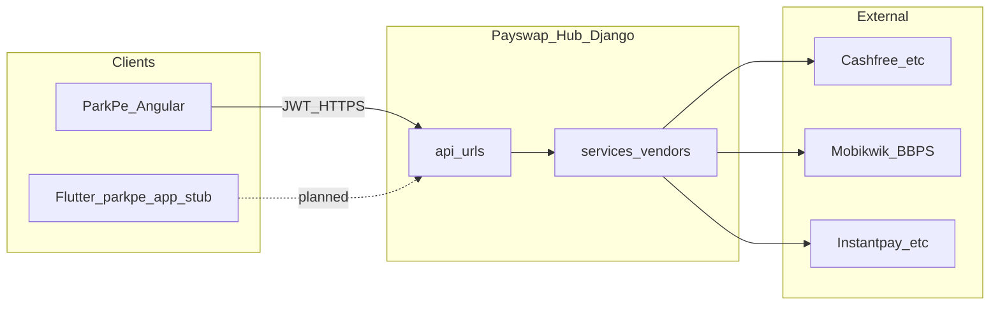

# ParkPe × Hub — Full inventory aur live-readiness report

**Scope:** Ye document repo ke current state ko reflect karta hai — ParkPe Angular client, Payswap Hub (Django), aur mobile (`parkpe_app`) readiness.

**Definitions:**

- **Hub** = Isi monolith Django backend: [`backend/core/urls.py`](../../backend/core/urls.py) par `path("api/", include("api.urls"))`, plus staff/ops UI [`backend/portal/urls.py`](../../backend/portal/urls.py).
- ParkPe clients vendors (Mobikwik, Cashfree, Instantpay, …) **directly** call nahi karte; wo sab Hub services ke through jaate hain.

**Mobile reality:** [`parkpe_app/`](../../parkpe_app/) Flutter project shell hai — **`lib/` Dart source is workspace snapshot mein missing** (platform boilerplate + default test). Production mobile ke liye pehle `lib/` implement karna hoga ya parity kisi aur branch se laani hogi. Reference: [`MVP_SPRINTS.md`](./MVP_SPRINTS.md).

**Doc tone:** Technical identifiers English; explanations Hinglish where the team prefers — production URLs/paths verbatim.

---

## 1) ParkPe Angular — routes / product areas (1-by-1)

**Source:** [`frontend/projects/parkpe/src/app/app.routes.ts`](../../frontend/projects/parkpe/src/app/app.routes.ts) + nested `*routes.ts`.

| # | Area | Paths / notes |
|---|------|----------------|
| 1 | **Home** | `/home` — public |
| 2 | **Auth** | `/auth/login`, `/auth/register`, `/auth/forgot-password` — `guestGuard` |
| 3 | **Fleet login** | `/fleet/login` — same login component, fleet flow |
| 4 | **Public Connect scan** | `/connect/scan/:qrCode` — no app layout, QR landing |
| 5 | **Session lock** | `/unlock` — PIN / step-up (`sessionLockGuard`) |
| 6 | **Fleet workspace** | `/fleet/interest`, `/fleet/control-center`, `/fleet/vehicles`, `/fleet/drivers`, `/fleet/trips`, `/fleet/compliance` — `fleetAuthGuard` on hub screens |
| 7 | **Consumer dashboard** | `/dashboard` |
| 8 | **Connect** | `/connect/*` — vehicles, scan, chats, embed, landing — [`connect.routes.ts`](../../frontend/projects/parkpe/src/app/features/connect/connect.routes.ts) |
| 9 | **Parking** | `/parking/*` — lazy loaded |
| 10 | **BBPS** | `/bbps/*` |
| 11 | **FASTag** | `/fastag/*` |
| 12 | **Challan** | `/challan/*` |
| 13 | **Payment** | `/payment/*` (history, checkout, reports shell, etc.) |
| 14 | **Vouchers** | `/vouchers/*` |
| 15 | **Profile** | `/profile/*` |
| 16 | **Settings** | `/settings` |
| 17 | **Notifications inbox** | `/notifications` |
| 18 | **Fallback** | `**` → `/home` |

---

## 2) API contract — `ApiBackend` methods (frontend ↔ Hub)

**Source:** [`frontend/projects/parkpe/src/app/core/api/api-backend.interface.ts`](../../frontend/projects/parkpe/src/app/core/api/api-backend.interface.ts).

Ye **checklist** hai: har method ka Hub par endpoint hona chahiye, aur [`real-api.service.ts`](../../frontend/projects/parkpe/src/app/core/api/real-api.service.ts) mein wire hona chahiye.

**Auth / security:** `login`, `fleetLogin`, OTP request/verify, `register`, `registerSendOtp`, `registerVerify`, pincode lookup, `logout`, `forgotPassword`, `getProfile`, `updateProfile`, PIN status/set/verify, passkey (status, register options/verify, auth options/verify, disable, credentials CRUD, recovery OTP), `getSecurityOverview`, `revokeSessions`, `getSecurityActivity`.

**Payments / vouchers:** `getGateways`, `createOrder`, `verifyPayment`, `getTransaction`, `getTransactionHistory`, `requestRefund`, `downloadReceipt`, voucher list/detail/reveal/claim, `getPaymentOrders`, `getVoucherStatement`.

**Parking:** `getLocations`, `getSlots`, `createBooking`, `getBooking`.

**BBPS:** `getCategories`, `getOperators`, `fetchBill`, `payBill`, `payCart`, favorites, saved bills CRUD.

**FASTag:** `createRechargeOrder`.

**Challan:** `searchChallans`, `getChallan`, `payChallan`.

**Dashboard / fleet / notifications:** `getDashboardSummary`, notification banners/feed/unread/read, `registerPushToken`, fleet control center, vehicles CRUD, roster link/unlink, drivers, trips (+ manual), compliance, trends, fleet interest status/submit.

---

## 3) Hub — ParkPe client ke liye mounted API prefixes

**Source:** [`backend/api/urls.py`](../../backend/api/urls.py).

| Prefix | Purpose |
|--------|---------|
| `/api/auth/` | ParkPe JWT + profile + security — [`backend/api/auth_parkpe/urls.py`](../../backend/api/auth_parkpe/urls.py) |
| `/api/connect/` | Vehicles, QR, calls, scanner OTP, chat, reports — [`backend/api/connect/urls.py`](../../backend/api/connect/urls.py) |
| `/api/bbps/` | Mobikwik BBPS — Angular sends `X-App: parkpe` |
| `/api/payment/` | Gateways, orders, verify, webhooks, transactions — [`backend/api/parkpe_api/payment_urls.py`](../../backend/api/parkpe_api/payment_urls.py) |
| `/api/fastag/` | FASTag recharge — [`backend/api/parkpe_api/fastag_urls.py`](../../backend/api/parkpe_api/fastag_urls.py) |
| `/api/voucher/` | Voucher list/detail/claim/reveal — [`backend/api/parkpe_api/voucher_urls.py`](../../backend/api/parkpe_api/voucher_urls.py) |
| `/api/dashboard/` | Summary, fleet, notifications, pincode — [`backend/api/parkpe_api/urls.py`](../../backend/api/parkpe_api/urls.py) |
| `/api/hub/` | Internal Hub RBAC (staff) — ParkPe end-user flow se alag |

**Portal (browser, staff):** Connect ops UI — [`backend/portal/urls.py`](../../backend/portal/urls.py) (`/connect/ops/`, moderation, analytics). Launch checklist: [`docs/CONNECT_LAUNCH_READINESS.md`](../CONNECT_LAUNCH_READINESS.md).

---

## 4) Architecture snapshot

---

## 5) Known gaps — production se pehle fix / decide

### A) `RealApiService` stubs

**Source:** [`frontend/projects/parkpe/src/app/core/api/real-api.service.ts`](../../frontend/projects/parkpe/src/app/core/api/real-api.service.ts).

| Client method | Behavior today |
|---------------|----------------|
| `requestRefund` | Always throws `UNSUPPORTED` (legacy BUG-006 note in file header) |
| Parking (`getLocations`, `getSlots`, `createBooking`, `getBooking`) | Always `UNSUPPORTED` even if `environment.features.parking` |
| Challan (`searchChallans`, `getChallan`, `payChallan`) | Always `UNSUPPORTED` |

**Action:** Either implement Hub routes + wire frontend, or hide / “coming soon” those UI flows so users do not hit dead ends.

### B) Payment gateway whitelist / split architecture

If the PG only allows **ParkPe domain/IP**, create-order and webhook routing may need the split described in [`.cursor/plans/parkpe_hub_unified_plan.md`](../../.cursor/plans/parkpe_hub_unified_plan.md). Hub already exposes related paths such as `POST /api/payment/orders/register` and `POST /api/payment/webhook/relay/cashfree` — verify env, DNS, and Cashfree dashboard against the deployment you actually run.

### C) Connect go-live

Run [`docs/CONNECT_LAUNCH_READINESS.md`](../CONNECT_LAUNCH_READINESS.md): risk env vars, abuse simulations, security tests, ops dashboard. Note: chat content storage / privacy expectations are documented there.

### D) Push / native mobile

[`FCM_AND_DEEP_LINKS.md`](./FCM_AND_DEEP_LINKS.md) — device registration model and FCM wiring must be aligned with backend before calling mobile “live”. Without `lib/` in repo, Flutter parity is not yet implementable here.

### E) Repo hygiene

Large dirty tree / stray files — review before merge (e.g. accidental `backend/Commande` or local-only artifacts).

---

## 6) Suggested fix order (sequencing)

1. Stabilize Hub + Angular contract — diff `ApiBackend` vs real `urls.py`; fix stubs or gate UI.
2. Payment E2E — create → redirect → verify → history; webhook + PG policy for your hosting model.
3. BBPS + voucher pay-cart — regression + staging Mobikwik credentials.
4. FASTag — recharge + errors.
5. Connect — launch readiness runbook + env thresholds.
6. Fleet workspace — roster, trips, compliance parity with UI.
7. Notifications — feed + push token path; FCM if in scope.
8. Challan / Parking — build backend or remove from navigation.
9. Flutter — bootstrap `lib/` per [`MVP_SPRINTS.md`](./MVP_SPRINTS.md) or explicitly defer mobile.

---

## 7) Gap triage priority (summary table)

| Priority | Item | Owner / artifact |
|----------|------|------------------|
| P0 | Stub APIs: refund, parking, challan in `RealApiService` | Frontend + backend contract |
| P0 | Payment + webhook URLs + secrets aligned with prod/staging | DevOps + [`payment_urls.py`](../../backend/api/parkpe_api/payment_urls.py) |
| P1 | Connect launch gate | [`CONNECT_LAUNCH_READINESS.md`](../CONNECT_LAUNCH_READINESS.md) |
| P1 | PG whitelist decision | [`.cursor/plans/parkpe_hub_unified_plan.md`](../../.cursor/plans/parkpe_hub_unified_plan.md) |
| P2 | Flutter `lib/` + JWT parity | [`MVP_SPRINTS.md`](./MVP_SPRINTS.md), [`FCM_AND_DEEP_LINKS.md`](./FCM_AND_DEEP_LINKS.md) |

---

## Appendix A — `/api/auth/*` (ParkPe)

Base: **`/api/auth/`** (mount: [`backend/api/auth_parkpe/urls.py`](../../backend/api/auth_parkpe/urls.py)).

| Method | Path |
|--------|------|
| POST | `login` |
| POST | `fleet/login` |
| POST | `otp/request` |
| POST | `otp/verify` |
| POST | `register/send-otp` |
| POST | `register/verify` |
| POST | `register` |
| GET/PATCH | `profile` |
| POST | `logout` |
| GET | `pin/status` |
| POST | `pin/set` |
| POST | `pin/verify` |
| GET | `passkey/status` |
| POST | `passkey/register/options` |
| POST | `passkey/register/verify` |
| POST | `passkey/auth/options` |
| POST | `passkey/auth/verify` |
| POST | `passkey/disable` |
| GET/POST | `passkey/credentials` |
| PATCH/DELETE | `passkey/credentials/<credential_id>` |
| POST | `passkey/recovery/request-otp` |
| POST | `passkey/recovery/verify-otp` |
| GET | `security-overview` |
| POST | `sessions/revoke` |
| GET | `security-activity` |
| POST | `forgot-password` |

---

## Appendix B — `/api/connect/*` (ParkPe Connect)

Base: **`/api/connect/`** (mount: [`backend/api/connect/urls.py`](../../backend/api/connect/urls.py)).

| Method | Path |
|--------|------|
| GET/POST | `vehicles/` |
| GET/PATCH/DELETE | `vehicles/<pk>/` |
| POST | `vehicles/<pk>/fastag-balance/` |
| POST | `vehicles/<pk>/delete-request/` |
| POST | `vehicles/<pk>/delete/` |
| POST | `vehicles/<pk>/unlock-rc/` |
| POST | `vehicles/<pk>/pay-rc-view/` |
| POST | `vehicles/<pk>/fetch-rc/` |
| GET | `vehicles/<pk>/qr/` |
| GET | `vehicle/by-qr/<qr_code>/` |
| GET | `vehicle/by-registration/<registration_number>/` |
| POST | `call/token/` |
| POST | `call/initiate/` |
| POST | `scanner/send-otp/` |
| POST | `scanner/verify-otp/` |
| GET | `chat/predefined-messages/` |
| GET/POST | `chat/threads/` |
| GET/PATCH | `chat/threads/<pk>/` |
| GET/POST | `chat/threads/<pk>/messages/` |
| POST | `chat/threads/<pk>/mark-read/` |
| GET/POST | `chat/threads/<pk>/presence/` |
| GET/PATCH | `chat/threads/<pk>/settings/` |
| POST | `chat/threads/<pk>/block/` |
| POST | `report/` |

---

## Appendix C — `/api/payment/*`, BBPS, FASTag, voucher, dashboard

**Payment** — base `/api/payment/` ([`payment_urls.py`](../../backend/api/parkpe_api/payment_urls.py)):

- `gateways`
- `create-order/<gateway>`
- `verify/<gateway>`
- `webhook/cashfree`
- `webhook/relay/cashfree`
- `orders/register`
- `transactions`
- `transactions/<transaction_id>/receipt/`
- `transactions/<transaction_id>`
- `stream/status/<order_id>`
- `orders`
- `voucher-statement`

**BBPS** — base `/api/bbps/` ([`bbps_parkpe/urls.py`](../../backend/api/bbps_parkpe/urls.py)):

- `categories`, `operators`, `fetch-bill`, `pay`, `pay-cart`
- `favorites`, `favorites/<operator_id>`
- `saved-bills`, `saved-bills/<pk>`, `saved-bills/<pk>/delete`

**FASTag** — base `/api/fastag/`:

- `recharge`

**Voucher** — base `/api/voucher/`:

- `vouchers/claim`, `vouchers`, `vouchers/<voucher_id>`, `vouchers/<voucher_id>/reveal-pin`

**Dashboard** — base `/api/dashboard/` ([`parkpe_api/urls.py`](../../backend/api/parkpe_api/urls.py)):

- `summary`
- `fleet/control-center`, `fleet/vehicles`, `fleet/roster`, `fleet/roster/<driver_id>`, `fleet/drivers`, `fleet/trips`, `fleet/compliance`, `fleet/trends`, `fleet/interest/status`, `fleet/interest`
- `pincode`
- `notifications`, `notifications/feed`, `notifications/unread-count`, `notifications/<notification_id>/read`, `notifications/push-token`

---

## Appendix D — Portal Connect ops (staff UI, not under `/api/`)

**Source:** [`backend/portal/urls.py`](../../backend/portal/urls.py).

| Path | Purpose |
|------|---------|
| `GET` `/connect/ops/` | Ops center HTML |
| `POST` `/connect/ops/moderation-action/` | Moderation actions |
| `GET` `/connect/ops/analytics/` | JSON analytics |

---

*Last updated from repo scan on implementation of this report. Re-run inventory when URLs or `ApiBackend` change.*
